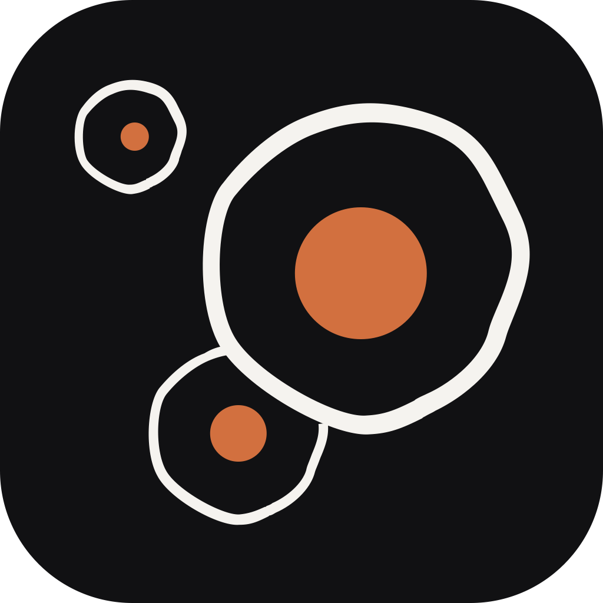
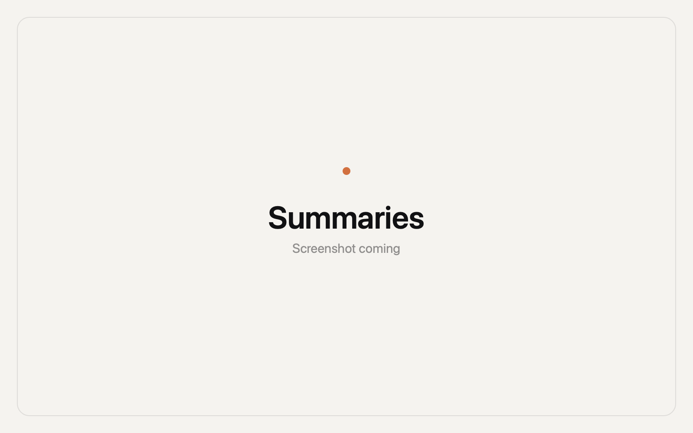
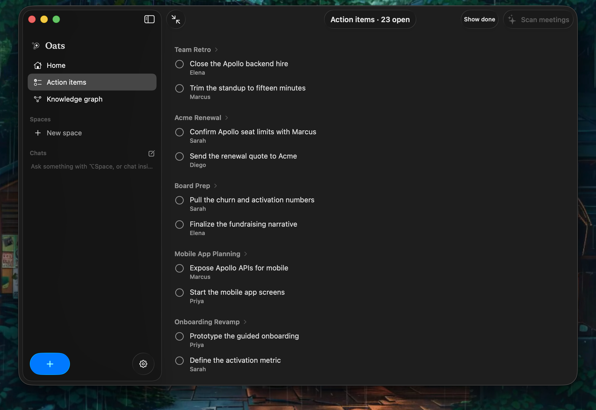
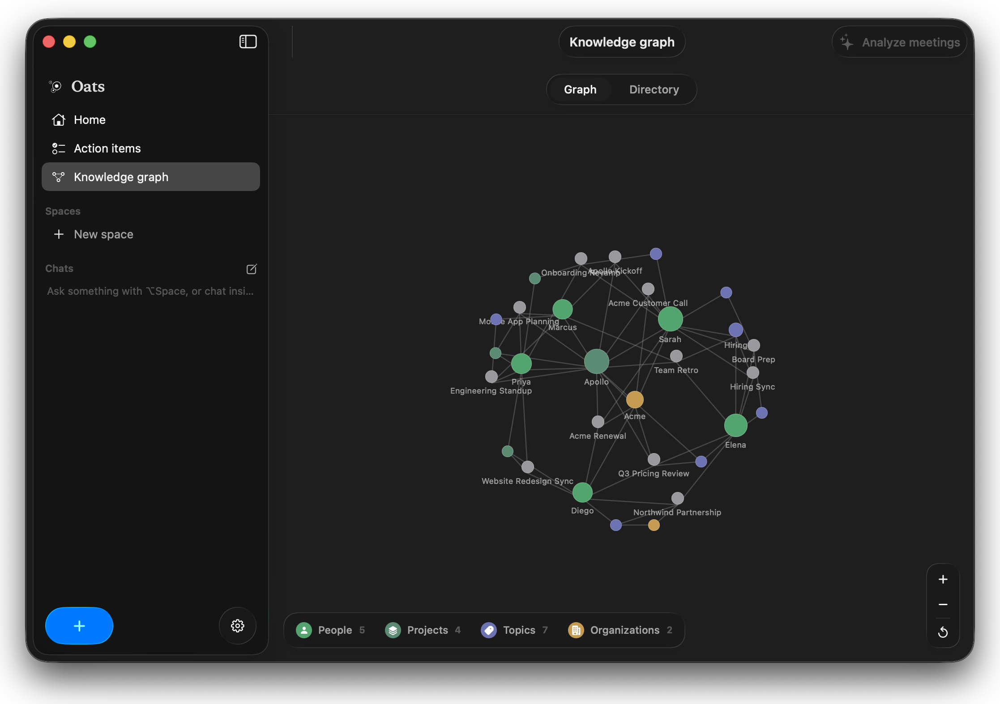
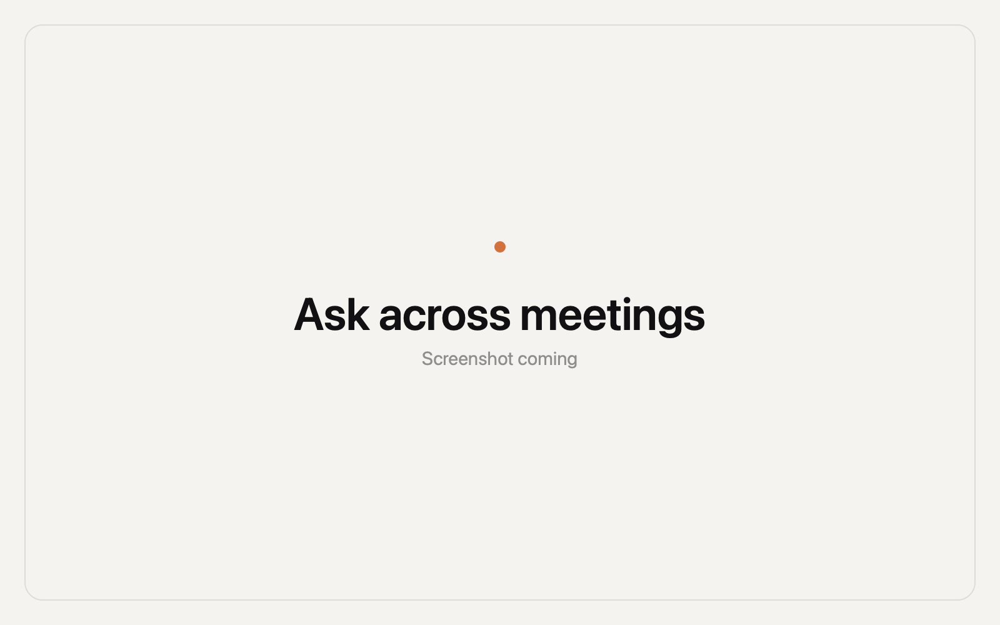

<div align="center">



# Oats

**Meeting notes that never leave your Mac.**

No bot joins your calls. No audio leaves your machine. No account, no subscription. Your notes are plain files you own, and the AI is a model that already runs on your Mac.

[](#install)
&nbsp;
[](#install)


&nbsp;

&nbsp;


</div>

---

Oats sits quietly in the corner of your screen. Press record, have your meeting, and when you stop it writes the summary, pulls out the action items, and files everything into a knowledge graph that connects people, projects, and topics across every meeting you have ever had. All of it happens on your Mac, with a model of your choosing.

<div align="center">

|  |  |
|:--:|:--:|
|  |  |
| **Summaries** written when you stop | **Action items** pulled out automatically |
|  |  |
| **Knowledge graph** across every meeting | **Ask** anything, grounded in your notes |

</div>

## What it does

### Record without a bot

Press Record, or hit your shortcut. Oats captures your microphone and your call's audio straight from the Mac, so nothing joins the meeting and no one on the other end sees a participant called "Notetaker." It transcribes live while you talk, marks who spoke, and lets you pause and resume.

### Summaries, when you stop

The moment a recording ends, the transcript goes to your local model and comes back as a clean summary with the decisions and the next steps. Titles are written for you a minute or two in, so your list is never a wall of "New note."

### Action items

Every commitment in the conversation gets pulled into one place, tied back to the meeting it came from. One view for everything you and your team agreed to do.

### Knowledge graph

People, projects, and topics are linked across all of your meetings into a single local memory. Ask who owns a project or when a topic last came up, and the answer is already connected.

### Ask anything

A summonable popup answers questions across your meetings: "What did I miss?", "What did we decide about pricing?", "List this week's action items." Answers stream in from your local model, grounded in your own transcripts. Chats live in the sidebar and can be grouped into Spaces (one per class, client, or project).

### Capture what is on screen

Grab any region of the screen, a slide, a chart, a whiteboard, into the note. The text is read on-device and feeds the summary too.

## Bring your own model

Oats does not ship a model or a cloud. You choose what runs, and everything stays local.

### Transcription

Speech becomes text with a local engine. Apple's is built in; the others download once and then run entirely on this Mac.

| Engine | Speed | Accuracy | When | Notes |
|---|---|---|---|---|
| **Apple Speech** | Fastest | High | Live, during the meeting | Built in, streams on the Neural Engine. The default. |
| **Parakeet v3** | Fastest | High | After the meeting | NVIDIA Parakeet, 25 languages. One combined transcript. |
| **Whisper Large v3 Turbo** | Fast | Highest | After the meeting | Near top accuracy, much faster than full Large. |
| **Whisper Large v3 / Small / Tiny** | Varies | Varies | After the meeting | Pick your own size and speed tradeoff. |

Only Apple's engine transcribes live. Whisper and Parakeet re-transcribe the recording after you stop, for higher accuracy, and produce one combined transcript without speaker labels. Download and switch engines any time in Settings.

### Summaries and chat

The reasoning model that writes summaries and answers questions is whatever you already have.

| Model | How to connect |
|---|---|
| **Apple Intelligence** | Built into macOS. Nothing to download. |
| **Claude Code** | Detected automatically if the `claude` CLI is installed. |
| **Codex** | Detected automatically if the `codex` CLI is installed. |
| **Ollama** | Any local model. Oats can download one for you, no terminal needed. |

There are no API keys and no Oats server. Transcripts are passed to the model as plain text, on your machine.

## Permissions

Oats asks for everything up front in the welcome flow, so recording just works, and it reminds you on the Home screen if anything is still missing.

- **Microphone**: hears your side of the meeting. Required.
- **System Audio**: hears the other side of the call, no bot. Required for calls.
- **Screen Recording**: only for capturing slides into a note. Optional.
- **Calendar**: shows today's meetings so you can start a note in one click. Optional.

Oats records only when you press Record and shows a visible recording state the whole time. Recording other people without their consent is illegal in many places. Always get consent when you transcribe others.

## Install

### Download

Grab the latest `Oats.dmg` from the [Releases page](../../releases/latest), open it, and drag Oats to your Applications folder. The App Store build is coming soon.

Oats requires **macOS 26 or later** on Apple Silicon.

### Build from source

Requires macOS 26+, Xcode 26+, and [XcodeGen](https://github.com/yonaskolb/XcodeGen).

```sh
xcodegen generate
xcodebuild -project Earshot.xcodeproj -scheme Earshot -configuration Debug -derivedDataPath build build
open build/Build/Products/Debug/Oats.app
```

Set your own `DEVELOPMENT_TEAM` in `project.yml`. A plain Apple Development certificate is enough for local use; no paid account needed. The first recording downloads Apple's on-device speech model for your language, which Oats pre-warms at launch.

## Your data

Notes are folders of plain files you own, at `~/Library/Application Support/Earshot/notes/<id>/`:

```
meta.json         title, date, duration
transcript.jsonl  every line, with speaker and timestamp
note.md           your own rich-text notes
summary.md        the generated summary
chat.jsonl        your questions and answers
audio.m4a         the recording
assets/           screen captures
```

Grep them, sync them, back them up. They are yours. The folder keeps the original codename so updates never orphan your notes.

## Keyboard shortcuts

| Shortcut | Action |
|---|---|
| `Opt` `M` | New note, or open the live one |
| `Opt` `Space` | Summon the Ask popup (configurable in Settings) |

## Privacy

No bot. No cloud transcription. No cloud model. No account. Everything Oats does, from listening to summarizing, happens on your Mac, and your notes are files on your disk.

## License

[Apache License 2.0](LICENSE)
